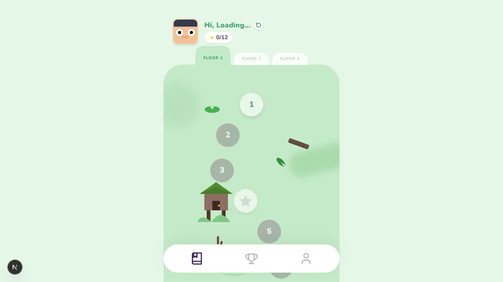
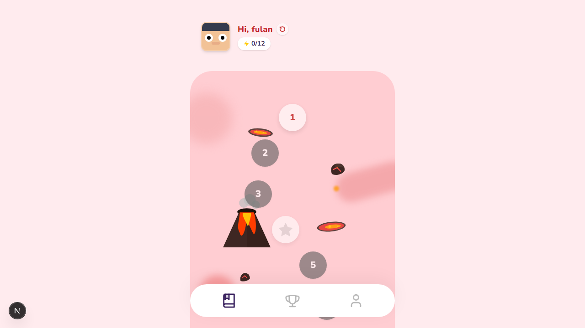
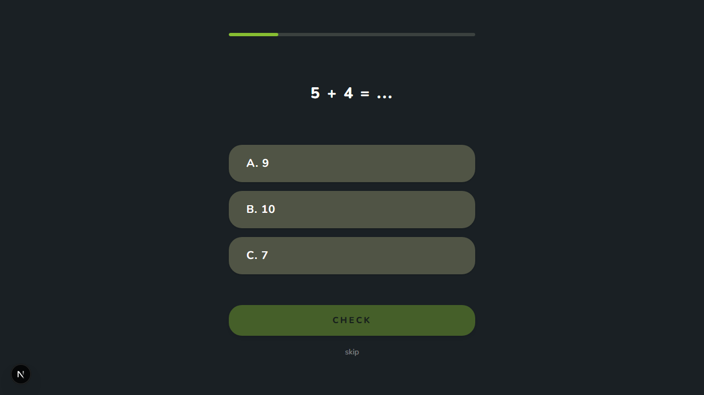

# 🌋 E-Learning App Misi Gunung Berapi (Gamifikasi Edukatif)

Selamat datang di repositori aplikasi E-Learning interaktif yang dirancang khusus untuk siswa jenjang dasar agar belajar menjadi sebuah petualangan seru! Aplikasi ini dilengkapi sistem "gamification" berbasis progres linear yang ramah anak.

## ✨ Fitur Utama

- **👦 Child-Friendly Onboarding**: Pengalaman selamat datang yang penuh warna, dilengkapi Ujian Diagnostik dan Pemilihan Minat Belajar. Menggunakan aset SVG interaktif yang memukau!
- **🏰 Sistem Floor & Node Progression**: Siswa harus menyelesaikan materi dan ujian selangkah demi selangkah. Modul tahap selanjutnya hanya akan terbuka jika modul (node) sebelumnya telah selesai, memacu semangat belajar.
- **🌋 Tema Khusus (Red Dashboard)**: Hadirnya tema "Gunung Berapi / Magma" dengan visual grafis resolusi tinggi dan dinamis yang dapat dinyalakan melalui menu *Profile*.
- **📜 Dashboard Tutorial**: Widget tutorial interaktif untuk siswa baru yang memberikan panduan langkah-demi-langkah yang membimbing pengguna dalam bernavigasi.
- **🚀 Avatars Dinamis & Skor Fleksibel**: Siswa memiliki avatar khusus, serta mengikuti sistem evaluasi bersahabat yang menampilkan kalkulasi penuh hanya di akhir sesi ujian.

## 📸 Tangkapan Layar (Screenshots)

Berikut sekilas tampilan UI/UX yang modern dari antarmuka E-Learning kami:

### Halaman Landing & Onboarding


### Dashboard - Gamifikasi Linear


### Red Volcano Dashboard


### Halaman Ujian Interaktif


## 🛠️ Teknologi yang Digunakan

Aplikasi canggih ini dibangun menggunakan standar modern:

- **Framework**: Next.js (App Router)
- **Komponen Inti**: React Server/Client Components dengan TypeScript
- **Kecantikan Desain**: TailwindCSS untuk micro-animations, glassmorphism, dan gradasi interaktif

## 🚀 Menjalankan di Local Environment

Cara terbaik melihat sendiri ajaibnya web aplikasi ini!

```bash
# 1. Jalankan development server (sudah ter-install module Next, React)
npm run dev
# atau gunakan yarn dev / pnpm dev
```

Lalu buka browser Anda ke tautan [http://localhost:3000](http://localhost:3000).

> **✨ Tips Testing:**
> Bila kamu login menggunakan akun dengan ID `student1`, kamu secara otomatis mendapatkan *bypass* untuk semua kunci "Node Progression" agar mudah mengeksplor materi!

---
Dibuat dengan dedikasi tinggi agar kegiatan Belajar dan Bermain bisa menyatu dengan sempurna! ❤️
